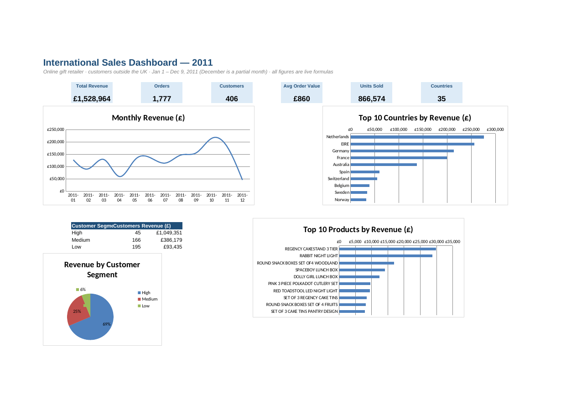

# 📊 International Sales Dashboard in Excel

 

An interactive **Excel dashboard** for a UK online gift retailer's **international (non-UK) sales in 2011**. It covers KPIs, monthly trend, top countries, best-selling products and customer value segments. **Every number is a live formula**, so the dashboard updates automatically when the data changes.

## 📊 Dataset
[UCI Online Retail](https://archive.ics.uci.edu/dataset/352/online+retail), filtered to **41,348 order lines** from **406 customers in 35 countries** (1 Jan – 9 Dec 2011). Cancellations, returns and rows without a customer ID were removed. Raw extract: [`data/international_sales_2011.csv`](data/international_sales_2011.csv)

## 🗂️ Workbook structure
| Sheet | What it does | Excel skills |
|---|---|---|
| **Dashboard** | 6 KPI cards, 4 charts, segment summary | `SUM`, `COUNT`, `COUNTIF`, `SUMIFS`, line/bar/pie charts |
| **Monthly** | Revenue, orders, AOV, MoM growth % | `SUMIFS`, `IFERROR`, data bars |
| **Countries** | Revenue, orders, customers, share, rank | `SUMIFS`, `COUNTIF`, `RANK`, colour scale |
| **Top Products** | Top 15 merchandise items | `SUMIFS`, data bars |
| **Customers** | Revenue and orders per customer, value segment | Nested `IF` driven by editable thresholds (yellow cells) |
| **Data** | Clean transactional table (Excel Table `Sales`) | Calculated columns: `Revenue = Qty × Price`, `NewOrder` flag, `TEXT()` month |

## 🏆 Key numbers
| Metric | Value |
|---|---|
| Total revenue | **£1,528,964** |
| Orders | 1,777 |
| Customers | 406 |
| Average order value | **£860** |
| Units sold | 866,574 |

## 💡 Insights
- **Netherlands (18.1%), EIRE (16.8%), Germany (14.0%) and France (13.0%)** bring in **62% of international revenue**.
- The Netherlands does the most revenue from just **8 customers**, a few large wholesale buyers, so it is a **concentration risk**.
- Revenue peaks in **October (£214.6K)** ahead of the holiday season. December is a partial month (data ends 9 Dec).
- **45 "High-value" customers (11%) generate 69% of revenue**. They are the accounts to protect.
- The top sellers are the **Regency Cakestand (£29.8K)** and the **Rabbit Night Light** (15,437 units, the most by volume).

## ▶️ How to use
Open `International_Sales_Dashboard_2011.xlsx` in Excel 2010+ (or Google Sheets / LibreOffice). Change the yellow threshold cells on **Customers** to re-segment customers; everything else recalculates on its own.

---
👤 **Ansh Rai**, Data Analyst · [LinkedIn](https://www.linkedin.com/in/anshrai-adr) · [GitHub](https://github.com/ANSHRAI21) · [Portfolio](https://a-s-pyratech-solutions.space)
